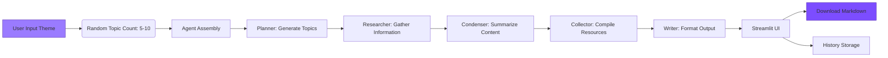

# Article Topic Generator with CrewAI 

This project is an **interactive web app** that uses CrewAI agents to:
1. Generate engaging topics based on a user-provided theme 🎯
2. Research each topic in-depth 🔍
3. Create structured article prompts with condensed information and resources ✨
4. Provide real-time progress tracking and downloadable results 📥

The system uses **Gemini 2.0 Flash** as its language model and features a modern Streamlit UI with custom styling and animations.

---

## Overview

This web app helps you brainstorm and organize article ideas on any theme. Just enter your topic, and get ready-to-use Markdown content with topics, subtopics, and sources - all in your browser.

---
 
## Features

- **Interactive Web UI**: Modern Streamlit interface with purple/black theme 🎨
- **Real-Time Progress**: Visual feedback during generation with task tracking ✅
- **Sidebar History**: Review, download, or delete previous generations 📚
- **One-Click Download**: Instant Markdown export from the browser 📥
- **Celebratory Effects**: Animations on task completion 🎉
- **Multi-Agent Workflow**: Five specialized agents collaborate:
  - Planner → Researcher → Condenser → Collector → Writer
- **Uses Gemini 2.0 Flash**: Fast and efficient topic generation ⚡
- **Random Topic Count**: Automatically selects 5-10 topics per theme 🎲
- **Error Handling**: Clear UI notifications for missing API keys or errors ⚠️
- **Mobile-Friendly**: Responsive design works on all devices 📱

---

## Repository Structure 
```
article-topic-generator/
├── app.py                     # Main Streamlit application
├── generator.py               # CrewAI agent/task implementation
├── styles.py                  # Custom CSS styling
├── scripts.py                 # JavaScript components
├── requirements.txt           # Dependency list
└── README.md                  # This documentation
```

---

## Dependencies
```python
crewai == 0.28.8
google-generativeai 
streamlit
streamlit-extras
pysqlite3-binary
```

---

## Requirements

- Python 3.10+
- Google API key for Gemini (set as environment variable)
- Internet connection

---

## Installation & Usage

### Local Execution
```bash
# Clone repository
git clone https://github.com/yourusername/article-topic-generator.git
cd article-topic-generator

# Install dependencies
pip install -r requirements.txt

# Set API key (Mac/Linux)
export GOOGLE_API_KEY='your-api-key-here'

# Run the app
streamlit run app.py
```

### Cloud Deployment
Visit the live app:  
https://agentic-ai-article-title-generator.streamlit.app/

---

## Workflow

1. **Enter Theme**: Type your article theme in the input field
2. **Topic Generation**: 
   - Random topic count (5-10) selected automatically 🎲
   - CrewAI agents collaborate in real-time 🤖
   - Progress displayed during execution ✅
3. **Results Display**:
   - Formatted Markdown output ✨
   - Download button for immediate export 📥
   - Celebration animation on completion 🎉
4. **History Management**:
   - Previous generations in sidebar 📚
   - Expand to preview, download, or delete 🗑️


---

## Agent Architecture
| Agent | Role | Key Function | Emoji |
|-------|------|-------------|-------|
| **Topic Planner** | Strategist | Generates theme-related topics | 🎯 |
| **Topic Researcher** | Investigator | Researches each topic in-depth | 🔍 |
| **Content Condenser** | Summarizer | Creates bullet-point summaries | ✨ |
| **Link Collector** | Archivist | Gathers research sources | 📚 |
| **Article Prompt Writer** | Compiler | Formats final output | ✍️ |

---

## Key Updates

- **New Web Interface**: Replaced CLI with interactive Streamlit app
- **Real-Time Progress**: Visual tracking of agent tasks
- **Session History**: Sidebar with previous generations
- **Browser Downloads**: No manual file management needed
- **UI Notifications**: Error messages and success alerts
- **Modern Styling**: Custom purple/black theme with animations

---

## Related Resources
- [CrewAI Documentation](https://docs.crewai.com)
- [Gemini API Guide](https://ai.google.dev)
- [Streamlit Documentation](https://docs.streamlit.io)
- [Streamlit Deployment Guide](https://docs.streamlit.io/deploy)

---

**This project is actively maintained. Feature suggestions and contributions are welcome!** 

---
