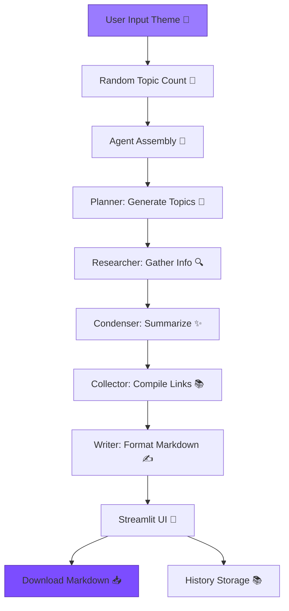

# ✨ Article Topic Generator with CrewAI & Gemini 2.0 Flash 

---

## 🎉 What is This?

A magical, interactive web app that uses **Gemini 2.0 Flash** and a team of CrewAI agents to:
- 🎯 Generate unique, creative topics for any theme
- 🤖 Research, condense, and format your ideas into ready-to-use Markdown
- 📚 Store your topic brainstorms in a sidebar history
- 📥 Let you download your results with a single click
- 🎈 Celebrate your creativity with confetti and balloons!

---

## 🌟 Key Updates

- **Web-First!** No more CLI—this is a full-featured Streamlit app with a modern, animated UI.
- **Real-Time Progress:** Watch as each agent completes its task, with visual feedback and party effects.
- **Session History:** Every brainstorm is saved in the sidebar—expand, preview, download, or delete!
- **Instant Downloads:** Download your Markdown results directly from the browser (no more hunting in the Downloads folder).
- **Mobile Ready:** Works beautifully on phones, tablets, and desktops.
- **Error-Proof:** Clear, friendly notifications if you forget your API key or something goes wrong.
- **Gemini 2.0 Flash + CrewAI:** Harness the latest Google LLM and agentic orchestration for super-fast, high-quality results.
- **All-in-One Setup:** Just `pip install -r requirements.txt` and `streamlit run app.py`—all dependencies are handled.

---

## 🖼️ App Preview

 collaborate on every run
- 🎲 **Random Topic Count:** Each brainstorm is a surprise—get 5 to 10 topics per session
- 📈 **Live Progress:** See each step as it happens, with animated feedback
- 📚 **Sidebar History:** Instantly revisit, download, or delete any previous brainstorm
- 📥 **One-Click Download:** Save your results as Markdown—no manual file wrangling
- 🎉 **Celebration Animations:** Balloons and confetti when your topics are ready!
- ⚡ **Powered by Gemini 2.0 Flash:** Lightning-fast, creative, and context-aware topic generation

## 🧠 How Does It Work?

**You type a theme.**  
The app spins up a team of AI agents, each with a special role:

| Agent | Emoji | Role |
|-------|-------|------|
| Topic Planner | 🎯 | Brainstorms creative topics for your theme |
| Topic Researcher | 🔍 | Digs up facts, trends, and news for each topic |
| Content Condenser | ✨ | Summarizes research into bite-sized prompts |
| Link Collector | 📚 | Gathers all the best sources and references |
| Article Prompt Writer | ✍️ | Formats everything into beautiful Markdown |

**All powered by Gemini 2.0 Flash for speed, creativity, and depth.**

## 🔄 Visual Workflow



## 🛠️ Installation & Quick Start

### Local Setup

```bash
git clone https://github.com/yourusername/article-topic-generator.git
cd article-topic-generator
pip install -r requirements.txt
export GOOGLE_API_KEY='your-gemini-api-key-here'  # (Mac/Linux)
# Or on Windows: set GOOGLE_API_KEY=your-gemini-api-key-here
streamlit run app.py
```

### Cloud Version

No setup needed!  
👉 [Try it live](https://agentic-ai-article-title-generator.streamlit.app/) in your browser.

## 🎮 How to Use

1. **Enter your theme** (e.g., "Space Technology", "Mental Health", "AI in Education")
2. **Click “🚀 Generate Topics”** and watch the magic happen
3. **See real-time progress** as each agent does its job
4. **Download your topics** as a Markdown file with one click
5. **Revisit your brainstorms** in the sidebar—expand, download, or delete any session
6. **Celebrate** with balloons and confetti when your ideas are ready!

## 🧩 Tech Stack

- **Streamlit**: Interactive Python web UI
- **CrewAI**: Multi-agent orchestration
- **Gemini 2.0 Flash**: Lightning-fast LLM from Google
- **Custom CSS & JavaScript**: For that extra sparkle ✨

## 📦 Project Structure

```
article-topic-generator/
├── app.py            # Main Streamlit app
├── generator.py      # CrewAI agent/task logic
├── styles.py         # Custom CSS
├── scripts.py        # JS components
├── requirements.txt  # All dependencies
└── README.md         # This file!
```

## 📚 Related Resources

- [CrewAI Documentation](https://docs.crewai.com)
- [Gemini API Guide](https://ai.google.dev)
- [Streamlit Docs](https://docs.streamlit.io)

## 💡 Why Gemini 2.0 Flash + CrewAI?

- **Gemini 2.0 Flash** brings:
  - Super-fast, context-rich text generation
  - Native tool calling and research capabilities
  - Multimodal support (text, images, data)
  - 1M token context for long, coherent outputs

- **CrewAI** orchestrates:
  - Five specialized agents working in sequence
  - Real-time callbacks for progress tracking
  - Modular, extensible agent design

## 📝 Contributing

Feature ideas? Found a bug?  
Open an issue or PR—let’s make brainstorming more fun, together! 🚀

**Built with ❤️ by [Your Name] and lots of ☕ + 🤖**  
**Star this repo if you like AI magic in your browser! 🌟**

**Ready to brainstorm? [Launch the app now!](https://agentic-ai-article-title-generator.streamlit.app/)**

*This README was generated with more emojis and caffeine than should be legally allowed.* 
